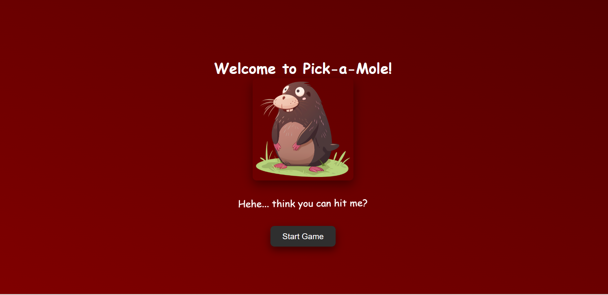
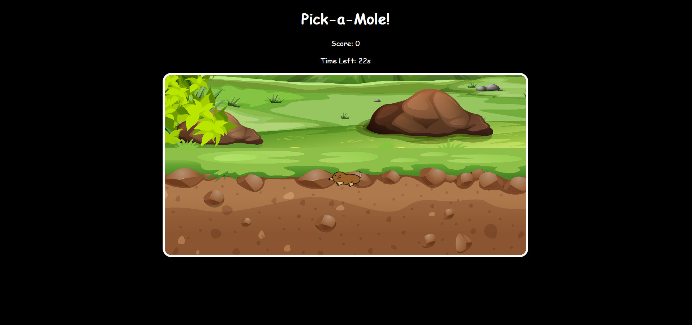

# 🕹️ Pick-a-Mole Game

A fun and interactive **web-based game** where the user has **30 seconds** to hit as many moles as possible!  
It’s built with **HTML, CSS, and JavaScript** and designed to deliver a simple yet addictive experience.  

---

## 🎯 Features

- ⏱️ 30-second gameplay timer  
- 🐹 Randomly appearing moles  
- 💥 Real-time scoring system  
- 🎨 Animated welcome screen with a mocking mole  
- 🏁 Result screen showing final score  

---

## 🧠 How It Works

1. The game starts from a **welcome page** with background animations.  
2. When you click **Start Game**, the timer begins.  
3. Moles pop up randomly — click them to score points!  
4. After 30 seconds, you’re redirected to the **results page** showing your score.  

---

## 🛠️ Tech Stack

- **Frontend:** HTML, CSS, JavaScript  
- **Styling:** CSS Animations  
- **Logic:** JavaScript DOM manipulation  

---

## 🚀 Live Demo

👉 [Play the Game Here](https://mtandrita.github.io/pick-a-mole-game/)  
 

---

## 🖼️ Screenshots

You can add screenshots of your game here to showcase how it looks!

### 🏠 Welcome Page

### 🎮 Gameplay

### 🏁 Results Page

